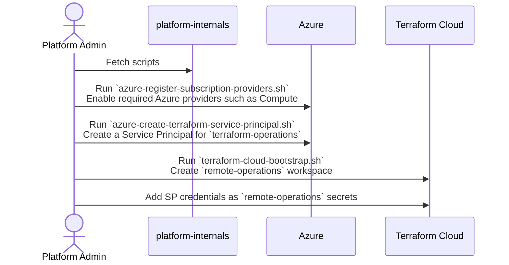
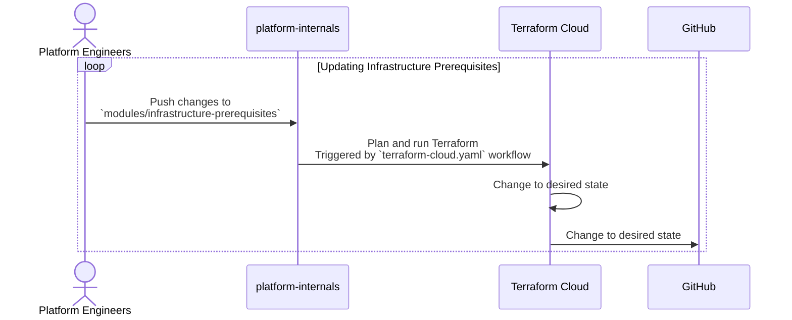

# Platform: Internals

## Overview

[](https://github.com/PashmakGuru/platform-internals/actions/workflows/terraform-cloud.yaml)

This repository is dedicated to bootstrapping and managing the infrastructure prerequisites of our platforms. It includes tasks such as:

- [x] Bootstrapping Azure subscriptions
- [x] Resolving Terraform Cloud chicke-and-egg problem
- [ ] Managing GitHub repositories
- [ ] Distributing credentials among repositories
- [ ] Managing Terraform Cloud organization, projects, workspaces, variable-sets, and custom modules

### Bootstrapping Sequence
```mermaid
info
```



### Synchronizing Infrastructure Prerequisites


## Components
The repository contains several scripts and modules designed to automate and simplify infrastructure management.

### Scripts
- [hacks/azure-create-terraform-service-principal.sh](hacks/azure-create-terraform-service-principal.sh): Runned manually, it automates the creation of an Azure service principal for Terraform Cloud.
- [hacks/azure-register-subscription-providers.sh](hacks/azure-register-subscription-providers.sh): Runned manually, it streamlines Azure setup by automating the registration of key service providers.
- [hacks/terraform-cloud-bootstrap.sh](hacks/terraform-cloud-bootstrap.sh): Runned through workflow, it automates the initial setup of Terraform Cloud to avoid chicken-and-egg problem with Terraform Cloud managing itself.

### Modules
- [modules/infrastructure-prerequisites](modules/infrastructure-prerequisites) (TODO): Manages Terraform Cloud configurations and GitHub repositories.

### Workflows
- [terraform-cloud.yaml](.github/workflows/terraform-cloud.yaml): Bootstrap remote-operations workspace and syncs [modules/infrastructure-prerequisites](modules/infrastructure-prerequisites).
